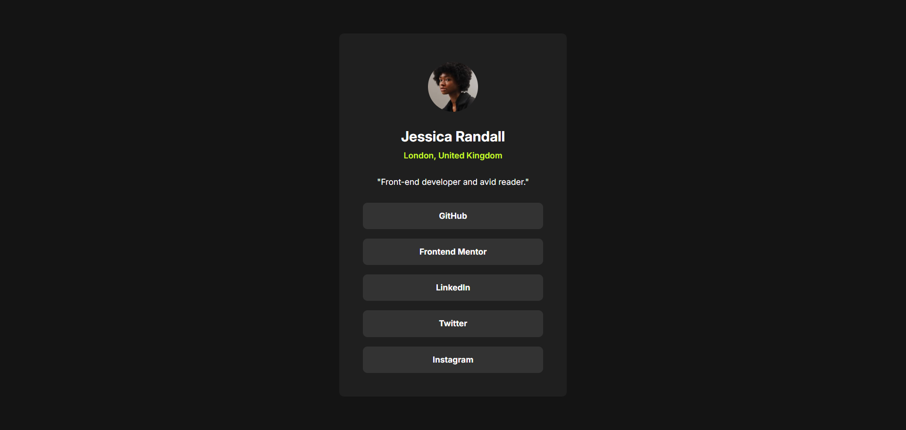

# 👤 Social Links Profile (Frontend Mentor)

Este projeto foi desenvolvido como parte do desafio [Social links profile](https://www.frontendmentor.io/challenges/social-links-profile-UG32l9m6dQ) da [Frontend Mentor](https://www.frontendmentor.io/home). A proposta era criar um **cartão de perfil com links para redes sociais**, seguindo um design pré-definido.

Aproveitei este desafio para me aprofundar no uso do SCSS, explorando variáveis, aninhamento e melhor organização do CSS.

## 👀 Preview

## ▶️ Demo

Clique <a href="https://social-links-profile-fem-zeta.vercel.app/" target="_blank" rel="noopener noreferrer">aqui</a>  para acessar o projeto online

## ⚙️ Funcionalidades

- 📱 **Design totalmente responsivo**, adaptando-se perfeitamente a diferentes tamanhos de tela.
- 🎨 **Efeitos de hover suaves nos links**, com transições que proporcionam uma experiência visual mais fluida.

## 💻 Tecnologias usadas

## 👨‍💻 Autor

<a href="https://portfolio-pessoal-alpha-nine.vercel.app/" target="_blank" rel="noopener noreferrer">Erik Alves</a>
